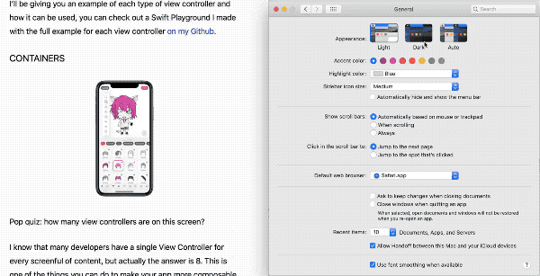

# DarkImagePublishPlugin 😎

A plugin for [Publish](https://github.com/JohnSundell/Publish) that lets you have two variants for images on your site: one for light mode, and one for dark mode. This is currently used in [rambo.codes](https://rambo.codes).



## How to use it

Just use the regular markdown syntax for images and the plugin takes care of the rest, so that the following markdown:

```markdown

```

Becomes this in HTML:

```html
<figure>
	<picture>
		<source srcset="/assets/img/2/1-dark.png" media="(prefers-color-scheme: dark)">
		
	</picture>
</figure>
```

## Installing the plugin

To install the plugin, add it to your site's publishing steps:

```swift
try mysite().publish(using: [
    .installPlugin(.darkImage()),
    // ...
])
```

You can customize the suffix that's used for the dark variant by passing the `suffix` parameter:

```swift
try mysite().publish(using: [
    .installPlugin(.darkImage(suffix: "bestmode")),
    // ...
])
```

## Light-only images

In some cases, you might have just a single variant of an image, so trying to load the dark variant would fail. If you have an image with only a single variant, add the `?nodark` suffix to your image's path/URL:

```markdown

```

In that case, the generated HTML will look like this:

```html
<figure>
	<picture>
		
	</picture>
</figure>
```